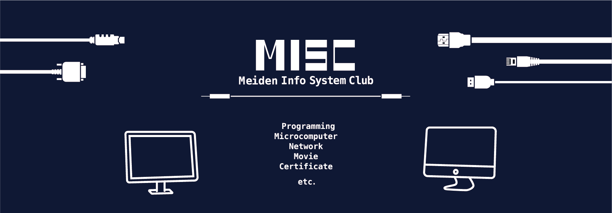

# 愛工大名電 情報システム部

**Hi, We are MISC 👋**  
私たちは**名電高校**の**情報システム部**です

2022 年度より **システムコンピュータ部** 改め **情報システム部** となりました  
**web サイト**や**システム制作**といったプログラミングや、  
**IT パスポート試験**や**基本情報技術者試験**などに向けた資格勉強をしています。

また**映像**・**音楽**・**3D モデリング**、**3D プリンター**や**レーザーカッター**を用いた作品を製作したりもします。

**個々の活動**を主としつつ、コンテストや発表に向けて**グループ**で活動することもあります。

活動場所は北校舎 4 階の 415 教室(コンピューター教室) です  

[公式サイト](https://misc-org.dev)